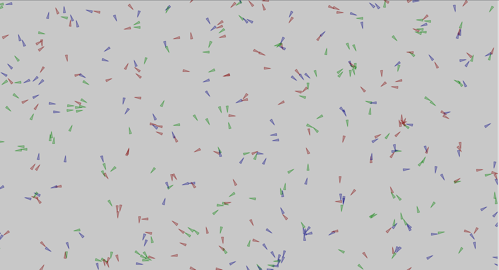
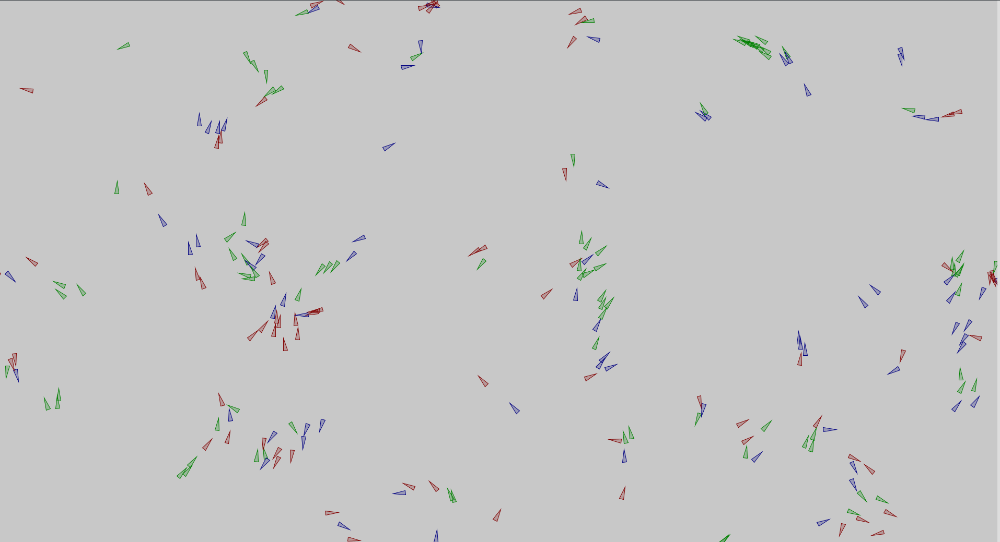

# Flocking Triangles
Simple application written in Processing to simulate different swarms of triangles which will coordinate their behaviour by applying simple rules.
Each swarm is hunting another swarm and each of them is hunted by one. 

